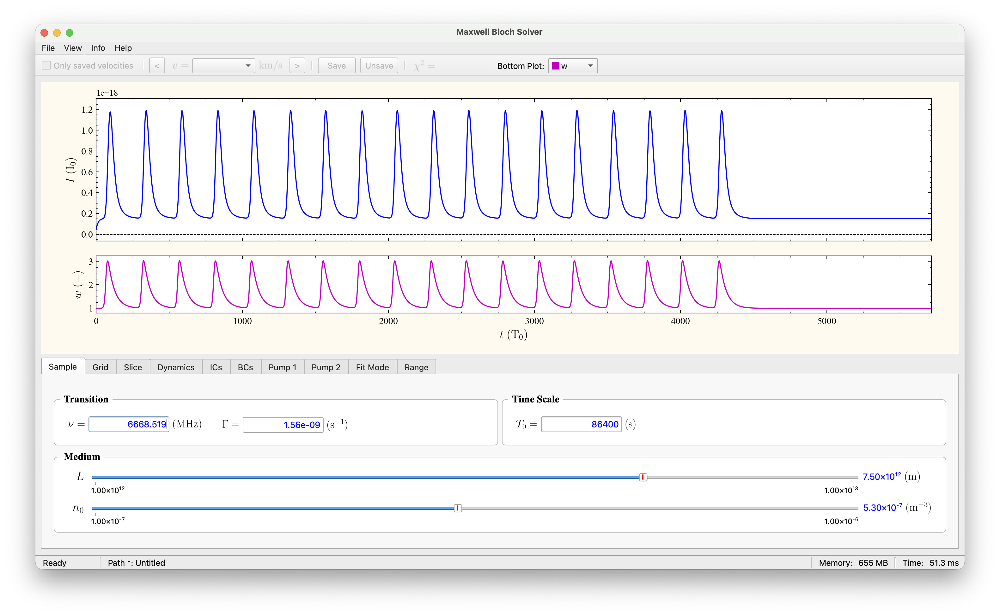

# Maxwell Bloch Solver

A PySide6 desktop application for simulating, visualizing, and fitting one-dimensional Maxwell-Bloch models to astronomical maser light-curve data. The application combines an interactive Qt interface, configurable physical and numerical parameters, Numba-accelerated time evolution, and publication-oriented plotting/export tools.

## Screenshot



## Features

- Interactive GUI for Maxwell-Bloch model configuration and visualization.
- Numba-accelerated numerical solver using Runge-Kutta time stepping.
- Light-curve import from velocity-tagged text files.
- Support for period-tagged source folders, e.g. multiple folded periods for the same source.
- Adjustable source, sample, initial-condition, pump-profile, and plotting parameters.
- Built-in visualization of fitted flux, inversion/population, pump terms, and other solver quantities.
- Parameter saving/loading using JSON files.
- Export to PDF, PNG, or SVG, with PDF exports including metadata and parameter reports.
- Local user guide, equations reference, and generated API documentation.

## Repository structure

```text
.
├── main.py                    # Application entry point
├── app/                       # Main window, plotting, solver controller, update pipeline
├── app_io/                    # Data and parameter import/export helpers
├── solver/                    # Maxwell-Bloch numerical solver
├── ui/                        # Qt widgets, sliders, labels, menus, status bar
├── dialogs/                   # Application dialogs
├── settings/                  # App metadata, style, defaults, and settings JSON
├── utils/                     # Units, constants, helper functions, solver-step viewer
├── assets/                    # App icons/images
└── docs/                      # User guide, equations reference, and API documentation
```

## Installation

This project requires Python 3.10 or newer. Python 3.11 or 3.12 is recommended.

Clone the repository and create a virtual environment:

```bash
git clone https://github.com/vahid-anari/maxwell-bloch-solver.git
cd maxwell-bloch-solver
python3 -m venv .venv
source .venv/bin/activate
python -m pip install --upgrade pip
```

Install the dependencies:

```bash
pip install -r requirements.txt
```

If you do not use `requirements.txt`, install the main packages manually:

```bash
pip install PySide6 numpy numba matplotlib psutil pygments
```

## Running the application

From the repository root, run:

```bash
python main.py
```

The application opens the Maxwell Bloch Solver GUI. Use the menu bar to load data folders, adjust parameters, run/refresh the solver, and export plots.

## Input data format

The application expects light-curve files as plain text files with at least two whitespace-separated columns:

```text
time flux
```

Blank lines and lines beginning with `#` are ignored.

Supported file-name patterns are:

```text
Source_v=12.3.txt
Source_p1_v=12.3.txt
```

where:

- `Source` is the source name,
- `p1`, `p2`, etc. are optional period labels,
- `v=12.3` is the velocity-component label.

Matching parameter files can be stored as:

```text
Source_params.json
Source_p1_params.json
```

When period-tagged files are present, the application lets the user select the period set to load.

## Exporting results

Plots can be exported from the GUI as:

- PDF
- PNG
- SVG

PDF exports include the plot plus a report page containing metadata and the current parameter state.

## Documentation

The `docs/` folder contains:

- `user_guide.pdf` — user-facing guide for the application,
- `equations_reference.pdf` — mathematical reference for the model equations,
- `docs/api/index.html` — generated API documentation.

These can also be opened from the application through the Help/Info menus.

## Development notes

Before committing to GitHub, avoid adding generated or local-only files such as:

- `__pycache__/`
- `.DS_Store`
- `.idea/`
- `.venv/`
- Numba cache files such as `*.nbc` and `*.nbi`

The included `.gitignore` is set up to exclude most of these files.

## License

This project is released under the MIT License. See [`LICENSE`](LICENSE) for details.
